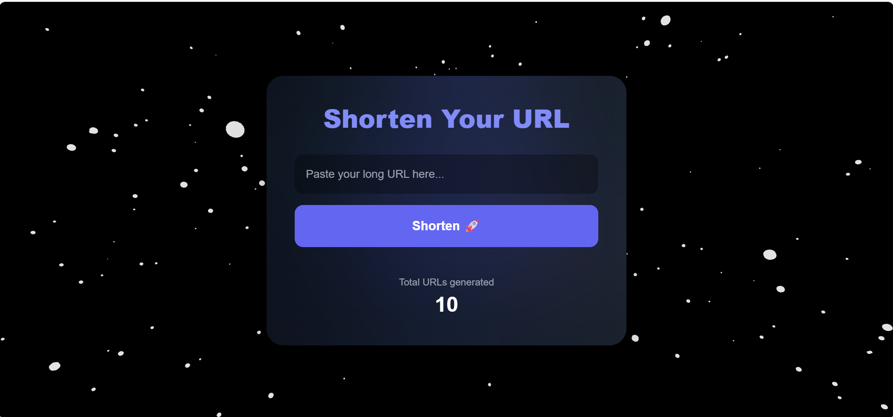

# URL Shortener

A full-stack URL shortening service that converts long URLs into short, shareable links with real-time analytics.

## 📸 Screenshots



## 🚀 Live Demo

[View Live Application](https://shorten-url-ui-tau.vercel.app/)

## 📋 Features

- **URL Shortening**: Generate short, unique codes for long URLs using Base62 encoding
- **URL Redirection**: Seamlessly redirect users to original URLs
- **Analytics Dashboard**: Track total number of shortened URLs
- **Responsive Design**: Modern UI with animated 3D background effects
- **RESTful API**: Clean API architecture for URL operations

## 🛠️ Tech Stack

**Frontend:**
- React.js
- Tailwind CSS
- Axios for API calls

**Backend:**
- Spring Boot
- MongoDB
- Base62 encoding algorithm

**Deployment:**
- Frontend: Vercel
- Backend: [Add your backend hosting]

## 📦 Installation & Setup

### Prerequisites
- Node.js (v14+)
- Java 17+
- MongoDB

### Frontend Setup
```bash
cd shortenr-url
npm install
npm start
```
Application runs on `http://localhost:3000`

### Backend Setup
```bash
cd shortener
./mvnw spring-boot:run
```
Server runs on `http://localhost:8080`

### Environment Variables

**Backend** (`application.properties`):
```properties
spring.data.mongodb.uri=your_mongodb_uri
base.url=http://localhost:8080
```

## 🔌 API Endpoints

| Method | Endpoint | Description |
|--------|----------|-------------|
| POST | `/api/shorten` | Create short URL |
| GET | `/{shortCode}` | Redirect to original URL |
| GET | `/api/count` | Get total URLs count |

## 🏗️ Architecture

- **Base62 Encoding**: Generates 7-character unique short codes
- **MongoDB**: Stores URL mappings and counters
- **Atomic Counter**: Thread-safe URL counting using MongoDB's findAndModify


